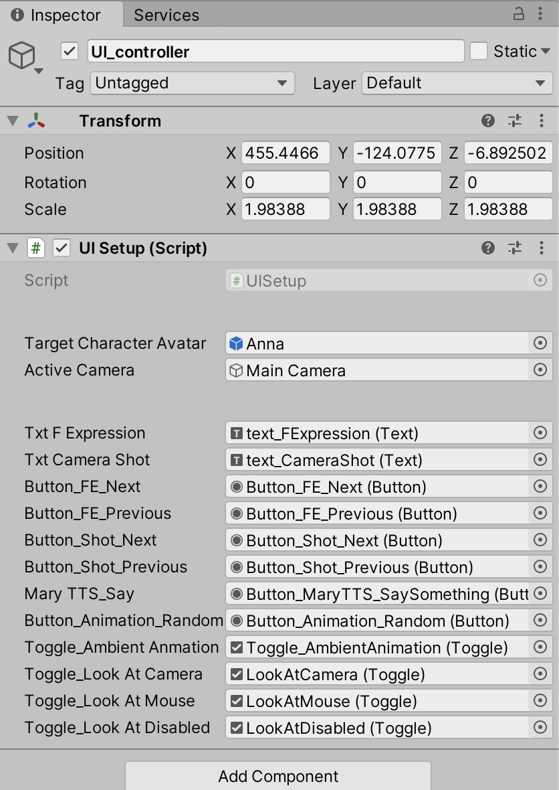

# DECAD Notes

DECAD stands for DFKI Embodied Conversational Agent Demo.
It is based on the YALLAH framework for the development of interactive virtual agents.

DECAD is a demonstrator of a character created with YALLAH, plus a set of scripts for the interactive control of the character via a dedicated GUI or HTML/JavaScript interface.
Its goal is to show the functionalities of YALLAH on several devices or via web pages.

In this document some notes on how to setup and configure the DEACD demo from a YALLAH package.

## Setup

* Follow the instrcutions / tutorials of YALLAH and create a scene with a character at its center.
* Rotate the character 180 degree along the vertical axis (Y).
* Add an empty object to the scene:
  * `Menu -> GameObject -> CreateEmpty`, and name it `SceneInit`.
  * This will be used to append global scripts.

## Camera control

The script `YALLAH/Script/camera/CameraCinemaControl.cs` allows to move the camera specifying framing typical of the cinema terminology (close-up, full-shot, etc).
Attach the script to the camera and fill-in the parameter `TargetCharacter`.

## GUI

The DECAD main scene contains a GUI, displayed as an overlay panel, to control the demo via click/touch.

To setup the GUI, use the `DECAD_GUI` prefab. You can copy it in the assets of your new project and configure it.

Expand the DECAD_GUI hierarchy and select the `UI_Controller`.
There, you can drag the references to the main character `Target Character Avatar`, the `Active Camer`, and the references to all the sub-components of the GUI. The list of objects to drag can be inferred by matching the name from the other children of the DECAD_GUI.

To make the GUI work: add the following component to the Main Camera:

* `Physical Raycaster`
* `Standalone Input Module`
  * It will automatically add also an `Event System`

The `DECAD_GUI`contains a `EyeGazeCollisionPlane`, which is an invisible flat pane that will be positioned in front of the character. It serves to collect collisions with the mouse raycast and drive the eye gaze to the (approximate) position of the mouse pointer on the screen.

## Web pages

Follow this instructions if you want to export the WebGL applicaiton with _JavaScript_ controls:

* Be sure you have the native code the in the `YALLAH` folder:
  * `Assets/YALLAH/Plugins/WebGL/native.h|.c`
* Add the `Native API Bridge` script to the `SceneInit`.
  * Configure it by selecting the references to the Avatar Mesh and to the main Camera.
* Move the `Assets/YALLAH/WebGLTemplates` to the root level, as `Assets/WebGLTemplates`, otherwise Unity won't see it.
* `Edit -> Project Settings...` select tab `Player` and config for `WebGL Settings`
  * `Resolution and Presentation -> WebGL Template` select `YALLAH_Sample_HTML_Template`

## Platform-specific requirements

Android:

* Add the `Assets/DECAD/Scripts/AndroidConfig` script to the `SceneInit`
